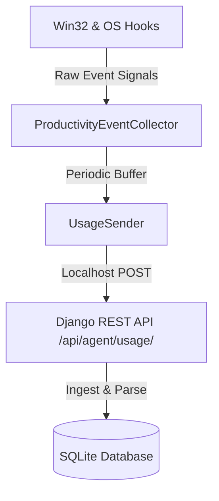

# ShortcutMaster AI Desktop Agent Scaffold

This folder houses the architecture scaffold for the Windows Desktop Agent. 

> [!NOTE]
> In this production MVP, live keyboard interception is mocked in the browser trainer to ensure zero-risk privacy. The local agent script exists as a validated architecture scaffold for future platform expansion.

---

## 1. System Architecture

The desktop agent is designed as a lightweight, background process running on the user's desktop client. It consists of three decoupled layers:



1. **`collector.py` (Collection Layer)**: Leverages platform-specific APIs to observe system activity and transform raw events into high-level category statistics.
2. **`monitor.py` (Monitoring Manager)**: Manages lifecycle loops, triggers snapshot generation, and processes local data filtering/anonymization rules.
3. **`sender.py` (Transmission Layer)**: Performs thread-safe HTTP POST requests to the Django backend.
4. **`config.py` (Configuration Layer)**: Holds local settings such as backend endpoints, transmission frequencies, and local privacy constraints.

---

## 2. Privacy & Security Rules

The agent complies with a strict **Privacy-First Agreement**. It is structurally impossible for the agent to log sensitive data:

* **Zero Content Collection**: The agent does not read clipboard strings, screenshot buffers, browser URLs, or active document titles.
* **Key Interception Bounds**: The agent monitors key events *only* to matches counts for structural modifier combos (e.g., `Ctrl+C`). It immediately discards character inputs, typing rhythms, and password combinations.
* **On-Device Anonymization**: All window names and processes are simplified to broad categories (e.g., matching window class `Chrome_WidgetWin` or executable `chrome.exe` to `"Chrome"`). The actual window title text is completely excluded.

---

## 3. Django API Integration

The transmission layer communicates with the local Django web service over a protected, localhost-only endpoint:

`POST http://127.0.0.1:8000/api/agent/usage/`

### Request Payload Shape
```json
{
  "applications": [
    {
      "app_name": "Chrome",
      "window_class": "Chrome_WidgetWin",
      "active_seconds": 3600,
      "switch_count": 38,
      "observed_on": "2026-07-14"
    }
  ],
  "events": [
    {
      "event_type": "app_switch",
      "app_name": "Chrome",
      "event_key": "app_switch",
      "count": 96,
      "metadata": {}
    }
  ]
}
```

### Security Verification
The Django endpoint validates remote network requests:
- Inspects incoming header `REMOTE_ADDR` or `HTTP_X_FORWARDED_FOR`.
- Automatically rejects any non-localhost requests (yielding `403 Forbidden`).
- Ignores payloads that do not match the expected JSON schema to ensure database schema safety.

---

## 4. Future Windows Implementation

To transition this scaffold to a live, native Windows agent, developers will utilize these components:

### 1. Active Window Tracking
Using `win32gui` and `win32process` to extract active window handles and map process executable names:
```python
import win32gui
import win32process
import psutil

def get_active_window_app():
    hwnd = win32gui.GetForegroundWindow()
    _, pid = win32process.GetWindowThreadProcessId(hwnd)
    try:
        proc = psutil.Process(pid)
        return proc.name(), win32gui.GetClassName(hwnd)
    except Exception:
        return "Unknown", ""
```

### 2. Modifier Key Counts
Using the Windows Hook API (`SetWindowsHookEx` with `WH_KEYBOARD_LL`) to capture low-level modifier flags without reading letter values:
```python
# Utilizing pynput or keyboard packages
from pynput import keyboard

def on_press(key):
    # Only track and increment structural modifier signals
    if key in {keyboard.Key.ctrl, keyboard.Key.alt, keyboard.Key.shift}:
        increment_modifier_metric(key)
```

### 3. Service Daemon Setup
Compile the Python agent into a background service using `PyInstaller` or run it as a Windows Scheduled Task on startup.
